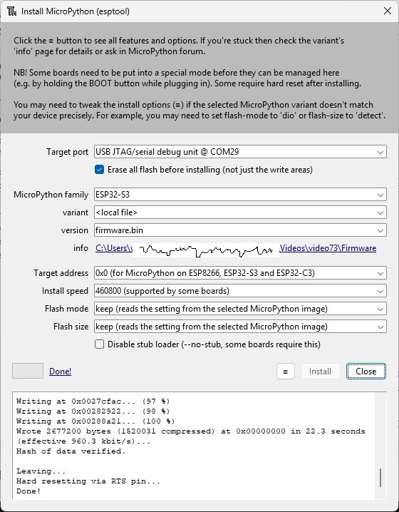

# README.md - Video 73

20 January 2026
23 January 2026 - added an image of deploying firmware
31 January 2025 - Added count label to test_button and revised tca9554 driver
06 February 2026 - see NOTE in Flash of Files

# Scope
This is video 73 on a MicroPython/LVGL embedded solution. In this video, we look at the Waveshare device and learn how to update the drivers.  We are using a firmware built for ESP32-Generic-S3 N16R8 USB boards (which includes this device).  We discuss and demonstrate three test LVGL programs.  In this video we focus on just getting the Display and Touchscreen to work.

You can fetch the firmware and programs from the GitHub, and begin using them immediately.  

In this video, 
 - Demonstrate three micropython LVGL programs.
 - Present the Waveshare ESP32-S3-Touch-LCD-3.5-C board.
 - Present the internal wiring and the changes to the drivers.
 - (Briefly) Walk through the program code.

The code for this video is available at the GitHub site:
https://github.com/kwinter745321/ESP32LVGL/tree/main/Videos/video73

# Files

 - Firmware
 
    - The file was built in December for a generic ESP32-S3 N16R8 device.
    - That is, a USB board with 16 MB flash and 8MB PSRAM

 - Desktop

    - test_scan_i2c.py
    - test_button_display.py
    - test_slider_display.py
    - test_matrix_display.py

 - Flash

    - ctp_ft6x36.py
    - display_driver.py
    - ili9xxx.py
    - lv_utils.py
    - pca9554.py
    - st77xx.py
  
 - FixedFlash

   - display_driver.py

      One viewer had trouble getting his LCD to Reset.  He solved by adding a function called lcd_reset()
      to the display_driver.  This code toggles the LCD RST and then leaves it set.

# Deploy Firmware

 Here is an image when I installed the firmware using Thonny:
  

